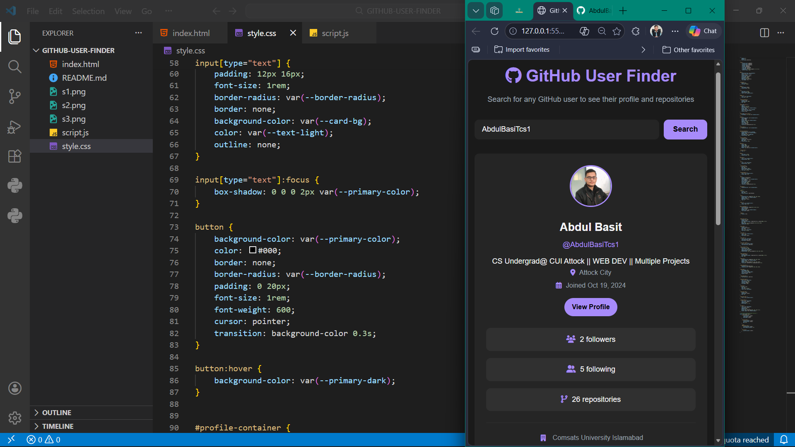

# GitHub User Finder

A sleek and responsive web application that allows users to search for GitHub profiles and view their latest repositories using the GitHub API.

## Features

- **User Search**: Quickly find any GitHub user by their username.
- **Profile Overview**: Displays essential profile information including:
  - Avatar
  - Bio
  - Location
  - Joined Date
  - Follower and Following counts
  - Total Public Repositories
- **Latest Repositories**: Showcases the 6 most recently updated repositories for the searched user.
- **Direct Links**: Quick access to the user's GitHub profile, website/blog, and Twitter.
- **Responsive Design**: Optimized for various screen sizes, providing a seamless experience on both desktop and mobile.

## Screenshots

## Technologies Used

- **HTML5**: For structure and semantics.
- **CSS3**: For modern, responsive styling and animations.
- **JavaScript (ES6+)**: For dynamic content fetching and DOM manipulation.
- **GitHub API**: To retrieve real-time data from GitHub.
- **Font Awesome**: For high-quality icons.

## How to Run

1. Clone this repository or download the source code.
2. Open `index.html` in your favorite web browser.
3. Start searching for GitHub users!

## Author

**Abdul BasiT**
- GitHub: [@AbdulBasiTcs1](https://github.com/AbdulBasiTcs1)